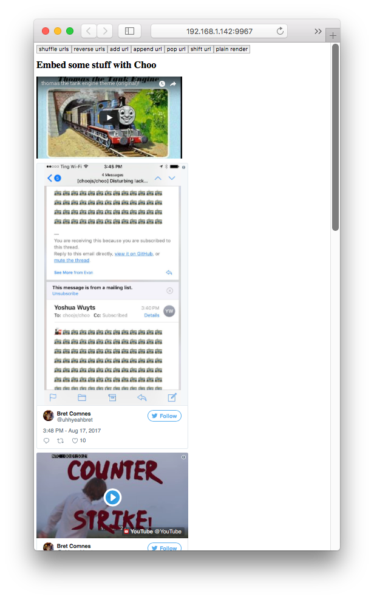

# nanomap [![stability][0]][1]
[![npm version][2]][3] [![build status][4]][5]
[![downloads][8]][9] [![js-standard-style][10]][11]

Functionally map data into stateful [nanocomponents][nc].



## Usage

```js
var Nanomap = require('nanocomponent/map')
var YoutubeComponent = require('youtube-component')
var TwitterComponent = require('twitter-component')
var OEmbedComponent = require('oembed-component')
var simpleMapper = new Nanomap(opts, TwitterComponent)
// OR
var complexMapper = new Nanomap(opts, {
  'video': YoutubeComponent,
  'tweet': TwitterComponent,
  ...,
  default: OEmbedComponent
})

[{
  id: 'foo123',
  opts: { color: 'blue' },
  arguments: {an: 'arg'} // Non-array types passed in as the first argument
}].map(simpleMapper) // Array of rendered DOM nodes from homogeneous components

[{
  id: 'foo123',
  type: 'tweet',
  arguments: ['tweet-url'] // component.render.apply(component, arguments)
}].map(complexMapper) // Array of rendered DOM nodes from a heterogeneous set of components
```

## Installation
```sh
$ npm install nanomap
```
## API
### `Nanomap = require('nanomap`)
Import `Nanomap` component class.

### `mapper = new Nanomap([opts], Component)`
### `mapper = Nanomap([opts], { type: Component, [default: Component]})`
Create a new mapper instance that will render data into component instances.

`opts` include:

```js
{
  gc: true // clean up unused instances when mapped over
}
```

See examples for more details.

## License
[MIT](https://tldrlegal.com/license/mit-license)

[0]: https://img.shields.io/badge/stability-experimental-orange.svg?style=flat-square
[1]: https://nodejs.org/api/documentation.html#documentation_stability_index
[2]: https://img.shields.io/npm/v/nanomap.svg?style=flat-square
[3]: https://npmjs.org/package/nanomap
[4]: https://img.shields.io/travis/bcomnes/nanomap/master.svg?style=flat-square
[5]: https://travis-ci.org/bcomnes/nanomap
[8]: http://img.shields.io/npm/dm/nanomap.svg?style=flat-square
[9]: https://npmjs.org/package/nanomap
[10]: https://img.shields.io/badge/code%20style-standard-brightgreen.svg?style=flat-square
[11]: https://github.com/feross/standard
[bel]: https://github.com/shama/bel
[yoyoify]: https://github.com/shama/yo-yoify
[md]: https://github.com/patrick-steele-idem/morphdom
[210]: https://github.com/patrick-steele-idem/morphdom/pull/81
[nm]: https://github.com/yoshuawuyts/nanomorph
[ce]: https://github.com/yoshuawuyts/cache-element
[class]: https://developer.mozilla.org/en-US/docs/Web/JavaScript/Reference/Classes
[isSameNode]: https://github.com/choojs/nanomorph#caching-dom-elements
[onload]: https://github.com/shama/on-load
[choo]: https://github.com/choojs/choo
[nca]: https://github.com/choojs/nanocomponent-adapters
[nc]: https://github.com/choojs/nanocomponent
